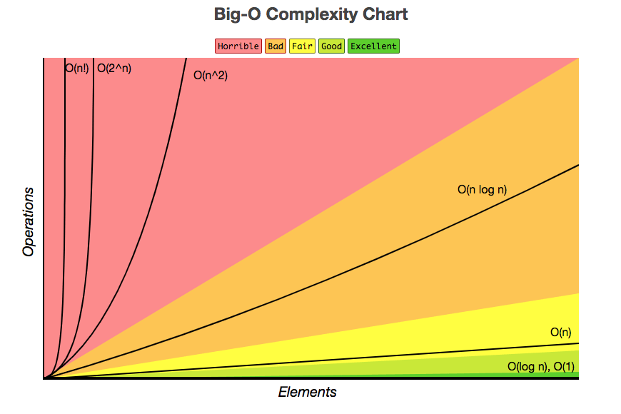

# Big O Notation

Here is some motivation for understanding Big O from Gayle Laakmann McDowell:

> Big O time is the language and metric we use to describe the efficiency of
> algorithms. Not understanding it thoroughly can really hurt you in developing
> an algorithm. Not only might you be judged harshly for not really understanding
> big O, but you will also struggle to judge when your algorithm is getting faster
> or slower. **Master this concept.**

## What is Big O?

The definition below is from the Wikipedia article on [big O notation](https://en.wikipedia.org/wiki/Big_O_notation).

> In computer science, big O notation is used to classify algorithms according
> to how their run time or space requirements grow as the input size grows.

In my university degree, this type of notation was also referred to as "asymptotic notation".
For the purposes of runtime analysis in competitive programming and interviews,
big O is used to describe the worst case scenario for solutions.

Big O is used to classify algorithms using what is called "[computational complexity theory](https://en.wikipedia.org/wiki/Computational_complexity_theory)".
What is most commonly used to describe an algorithm is its "[time complexity](https://en.wikipedia.org/wiki/Time_complexity)",
which is the computational complexity that describes the amount of time it takes
to run an algorithm.

Here is an excellent graph of runtime complexity created by [Big-O Cheat Sheet](https://www.bigocheatsheet.com/):



## Four Simple Rules

In a [video with Gayle Laakmann McDowell](https://youtu.be/v4cd1O4zkGw), she
provides four simple rules when trying to figure out an algorithm's time complexity:

### Rule 1: Different steps get added

For example, if you have one step that takes `O(a)` time and a second step that
takes `O(b)` time, the full algorithm would be `O(a+b)`:

```js
function something() {
  doStep1(); // O(a)
  doStep2(); // O(b)
}
```

### Rule 2: Drop constants

In the below example, one algorithm finds the min element in an array, then the
max element. The second algorithm finds both simultaneously. These are both
described as `O(n)` where `n` is the length of the array:

```js
function minMax1(array) {
  let min = 0;
  let max = 0;
  for (let i=0; i < array.length; i++) { // O(n)
    min = Math.min(array[i], min);
  }
  for (let i=0; i < array.length; i++) { // O(n)
    max = Math.max(array[i], max);
  }
}

// versus

function minMax2(array) {
  let min = 0;
  let max = 0;
  for (let i=0; i < array.length; i++) { // O(n)
    min = Math.min(array[i], min);
    max = Math.max(array[i], max);
  }
}
```

How is the `minMax1` function `O(n)`? To add up the runtime, `O(n) + O(n) = O(2n)`,
but we **drop the constant** (`2` in this case) to get `O(n)` because we are looking
for how the algorithm scales roughly (_i.e._ is it linear? Is it quadratic?).

### Rule 3: If you have different inputs, you'll use different variables to represent them

For example, it would be a mistake to say the algorithm below is `O(n^2)`:

```js
function intersectionSize(arrayA, arrayB) {
  let count = 0;
  for (let i=0; i < arrayA.length; i++) {
    for (let j=0; j < arrayB.length; j++) {
      if (arrayA[i] === arrayB[j]) {
        count += 1;
      }
    }
  }
}
```

`n` cannot be used to describe the length of an array if there are two different
arrays. Instead, if we let `a` be the length of `arrayA` and `b` be the length
of `arrayB`, this algorithm would run in `O(a*b)`.

### Rule 4: Drop non-dominant terms

In the algorithm below, we have a part of it that runs in `O(n)` and another
that runs in `O(n^2)`, where `n` is the length of the array:

```js
function whyWouldIDoThis(array) {
  let max = null;
  for (let i=0; i < array.length; i++) { // O(n)
    max = Math.max(array[i], max);
  }
  console.log(max);
  // O(n) * O(n) = O(n*n) = O(n^2)
  for (let i=0; i < array.length; i++) { // O(n)
    for (let j=0; j < array.length; j++) { // O(n)
      console.log(array[i], array[j]);
    }
  }
}
```

As a first "non-simplified form" we _could_ describe this algorithm as running
in `O(n + n^2)` time, but if we compare this runtime:

`O(n^2) <= O(n + n^2) <= O(n^2 + n^2)`

> Based off Rule 2 (drop constants), `O(n^2 + n^2) = O(2n^2)` which reduces to
> `O(n^2)`. Since the left and right of the comparison are equivalent, then the
> center must be as well: `O(n^2) <= O(n + n^2) <= O(n^2) -> O(n^2)`

We can reduce this algorithm's runtime down to `O(n^2)`, hence
**dropping the non-dominant term** `n`, because `n^2` dominates how the runtime
changes. Therefore, `O(n + n^2) -> O(n^2)`.

## Confusion on Whether to Add or Multiply Runtimes

This is a common one to get tripped up on when you're dealing with an algorithm
that has multiple steps.

```java
// O(a+b)
for (int a : arrA) {
  print(a);
}

for (int b : arrB) {
  print(b);
}
```

```java
// O(a*b)
for (int a : arrA) {
  for (int b : arrB) {
    print(a + "," + b);
  }
}
```

**Add the Runtimes `O(a+b)`** | **Multiply the Runtimes `O(a*b)`**
--- | ---
We do `a` chunks of work then `b` chunks of work. | We do `b` chunks of work for each element in `arrA`
"fo this, then, when you're all done, do that" | "do this for each time you do that"

## `O(log n)` Runtimes

A good example of logarithmic time complexity is finding an item in a sorted
array with a binary search or a balanced search tree. In binary search, we are
looking for an element `k` in an array of `n` elements. We first compare `k` to
the midpoint in the array. If `k` is equal to the middle element, we are done,
but otherwise we go to the left half of the array if `k < middle` and to the
right half if `k > middle`.

We start out with `n` elements to search, then this becomes `n/2` elements, then
`n/4` elements, and so on. When you see a problem where the number of elements
being iterated through is halved each step, this is likely a `O(log n)` runtime.

## Recursive Runtimes

As an example, many people (including myself) would wrongly say that the below
code runs in `O(n^2)`:

```js
function recursiveFunction(n) {
  if (n <= 0) {
    return 1;
  }
  return recursiveFunction(n - 1) + recursiveFunction(n - 1);
}
```

If we call `recursiveFunction(4)`, this calls `recursiveFunction(3)` twice. Each
of those calls to `recursiveFunction(3)` call `recursiveFunction(2)` twice, until
we reach `recursiveFunction(1)`.

The call tree will have a depth of `n`. Each node/function call has two children.
Therefore, each level of the call tree will have twice as many calls as the one
above it. Often, the runtime will look like `O(branches ^ depth)`, where `branches`
is the number of times each recursive call branches out. In this specific case,
we have a runtime of `O(2^n)`.
